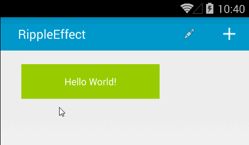

JJRippleWrapper
==========

Ripple Effect by [traex](https://github.com/traex) with [JJLayout](https://github.com/Only-IceSoul/JJLayout/blob/master/README.md) Attributes


## Usage

1.-Add it in your root build.gradle at the end of repositories:
```
allprojects {
		repositories {
			...
			maven { url 'https://jitpack.io' }
		}
	}
```
2.- Add the dependency
```
dependencies {
	        implementation 'com.github.Only-IceSoul:JJRippleWrapper:1.0'
	}
```


**Preview**




Declare a RippleView inside your XML layout file with a content like an TextView or whatever.


```xml
   <com.jjlf.jjkit_ripplewrapper.JJRippleWrapper
        android:id="@+id/ripple"
        android:layout_width="wrap_content"
        android:layout_height="wrap_content"

        app:clCenterInParent="true"

        android:padding="20dp"
        android:background="@android:color/holo_green_dark">
        <TextView
            android:background="@android:color/holo_blue_dark"
            android:id="@+id/textView"
            android:layout_width="wrap_content"
            android:layout_height="wrap_content"
            android:text="TextView"
            android:gravity="center"
            />

    </com.jjlf.jjkit_ripplewrapper.JJRippleWrapper>

```

If you want to know when the Ripple effect is finished, you can set a listener on your view

```kotlin
        rippleView.setOnRippleCompleteListener {
            Log.e("Ripple","Animation end")
        }
```


## Customization

You can change several attributes in the XML file

* app:rw_alpha [integer def:90 0-255] --> Alpha of the ripple
* app:rw_framerate [integer def:10] --> Frame rate of the ripple animation
* app:rw_rippleDuration [integer def:400] --> Duration of the ripple animation
* app:rw_ripplePadding [dimension def:0] --> Add a padding to the ripple
* app:rw_color [color def:@android:color/white] --> Color of the ripple
* app:rw_centered [boolean def:false] --> Center ripple in the child view
* app:rw_type [ def:simpleRipple ] --> Simple or double ripple
* app:rw_zoom [boolean def:false] --> Enable zoom animation
* app:rw_zoomDuration [integer def:150] --> Duration of zoom animation
* app:rw_zoomScale [float def:1.03] --> Scale of zoom animation
* app:rw_maxRadius [dimension def: minSize] -> ripple radius size
* app:rw_maxRadiusResponsive [reference (Array dimension (4))  def: null] -> ripple radius size
* app:rw_maxRadiusPercentScHeight [float def: null] -> ripple radius size based on percent to screen height
* app:rw_maxRadiusPercentScWidth [float def: null] -> ripple radius size based on percent to screen width


For each attribute you can use getters and setters to change values dynamically.


 **Radius responsive XML:**


 Based in Height

2600px to Infinite xHigher  
2001px to 2599px Higher  
1300px to 2000px Medium  
1px to 1299px Small  

```xml
      <array name="radius" >
        <item>15dp</item>  xHigher
        <item>14dp</item>  Higher
        <item>13sp</item>  Medium
        <item>12px</item>  Small
      </array>
```


## Troubleshooting

If you want to use the double ripple you have to set a background for the RippleView or for its child.


# License

[See license](https://github.com/Only-IceSoul/JJRippleWrapper/blob/master/LICENSE)